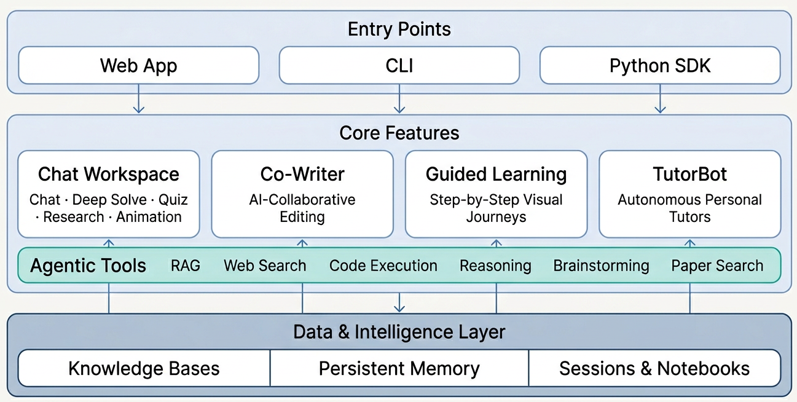
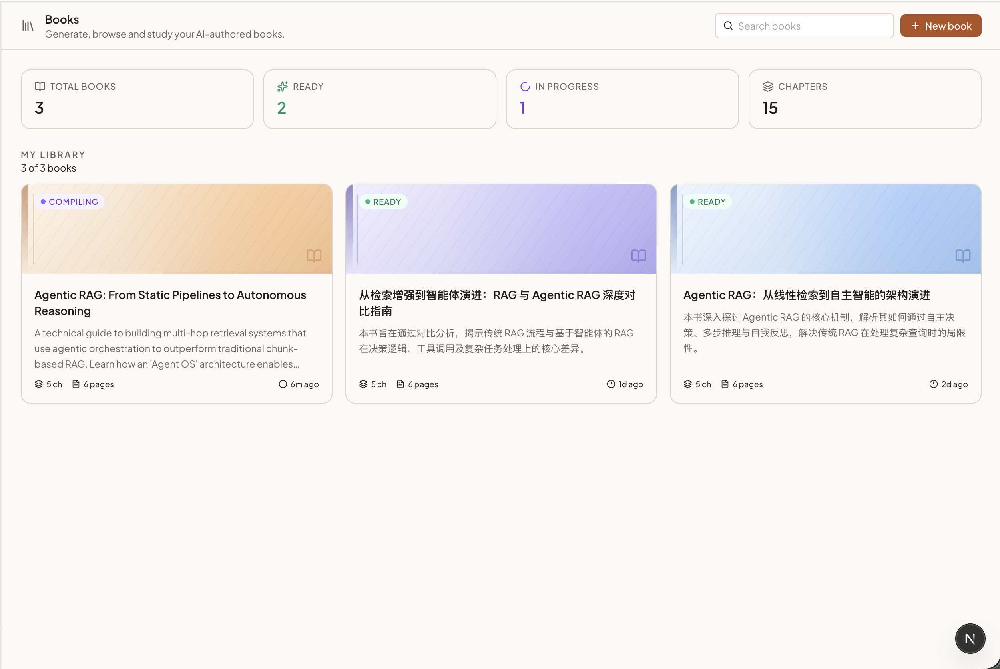
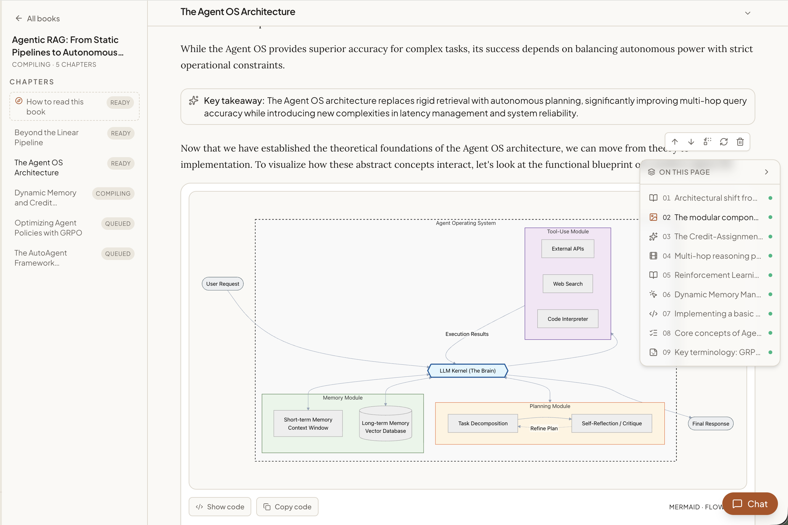
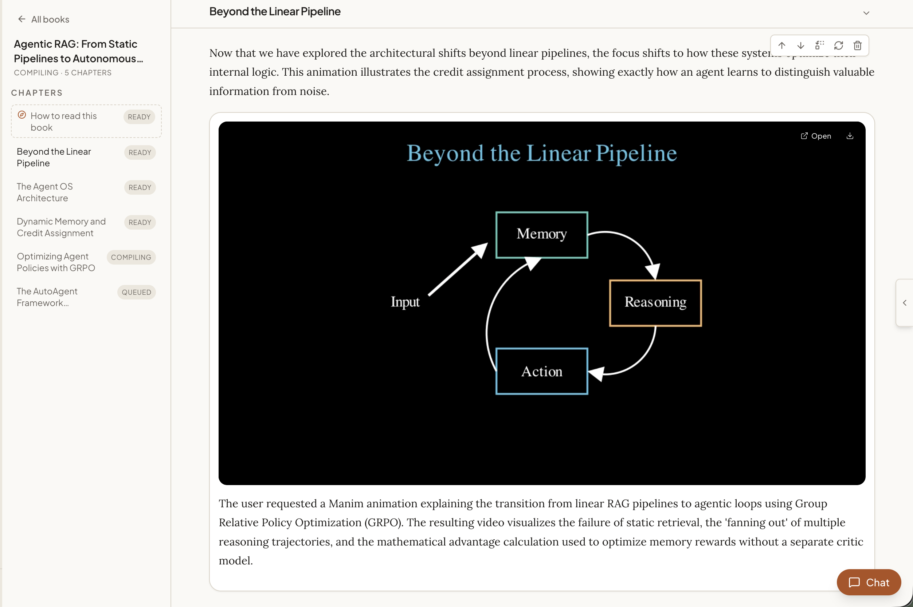
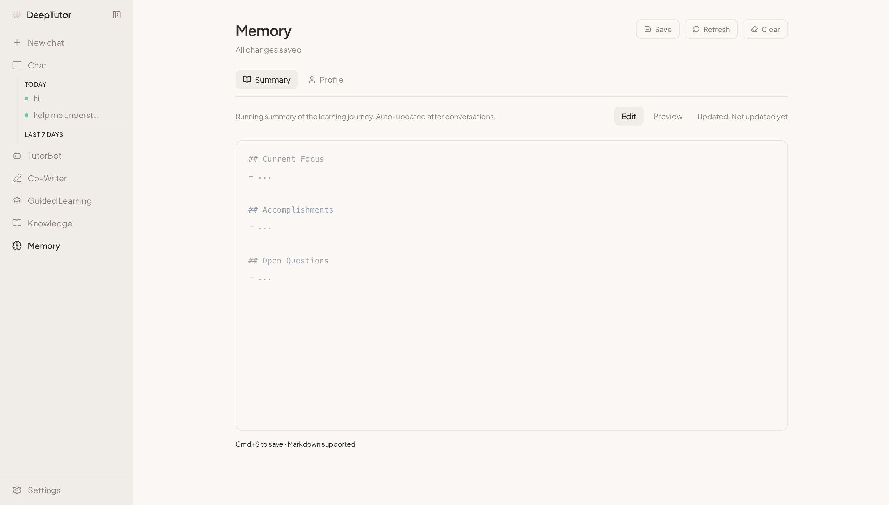
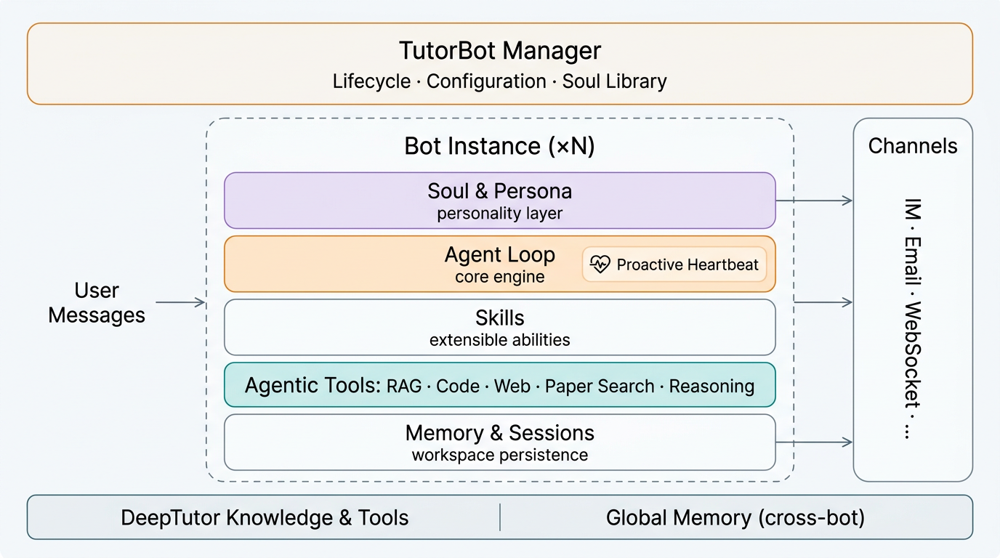
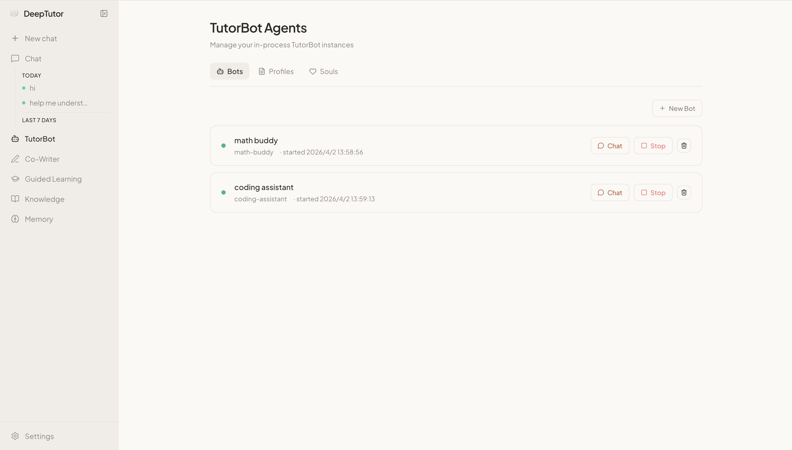
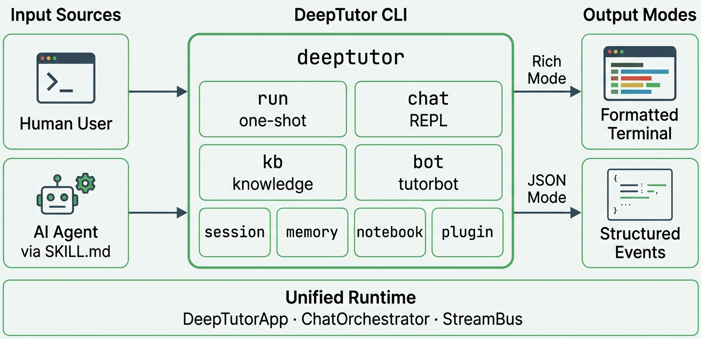
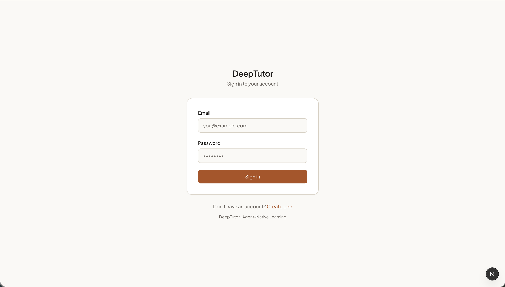

<div align="center">


# DeepTutor Bridge：面向 DeepTutor 的低侵入第三方集成版

<a href="https://trendshift.io/repositories/17099" target="_blank"></a>

[](https://www.python.org/downloads/)
[](https://nextjs.org/)
[](../../LICENSE)
[](https://github.com/HKUDS/DeepTutor/releases)
[](https://arxiv.org/abs/2604.26962)

[](https://discord.gg/eRsjPgMU4t)
[](../../Communication.md)
[](https://github.com/HKUDS/DeepTutor/issues/78)

[核心亮点](#key-features) · [快速开始](#quick-start) · [开发](#development) · [部署](#deployment) · [探索 DeepTutor](#explore-deeptutor) · [TutorBot](#tutorbot) · [CLI](#deeptutor-cli) · [多用户](#multi-user) · [路线图](#roadmap) · [社区](#community)

[🇬🇧 English](../../README.md) · [🇯🇵 日本語](README_JA.md) · [🇪🇸 Español](README_ES.md) · [🇫🇷 Français](README_FR.md) · [🇸🇦 العربية](README_AR.md) · [🇷🇺 Русский](README_RU.md) · [🇮🇳 हिन्दी](README_HI.md) · [🇵🇹 Português](README_PT.md) · [🇹🇭 ภาษาไทย](README_TH.md) · 🇵🇱 [Polski](README_PL.md)

</div>

---

> **项目定位**  
> **DeepTutor Bridge** 是基于 HKUDS 官方 [DeepTutor](https://github.com/HKUDS/DeepTutor) 的第三方 fork 发行版，重点面向第三方 Git 开源库与应用的集成接入，同时尽量保持上游仓库目录结构、包结构与运行入口不变。
>
> **来源、归属与版权说明**  
> 官方 DeepTutor 的品牌、版本历史、论文链接与上游原生能力说明，仍归属于 HKUDS 与 DeepTutor 贡献者。除非另有说明，本仓库内继承自上游的代码与文档继续遵循原始 [Apache License 2.0](../../LICENSE)。本 fork 的新增内容主要聚焦于集成定位说明与低侵入扩展指引。
>
> **命名边界**  
> 本文档中，**“官方 DeepTutor”** 专指 HKUDS 上游项目，**“DeepTutor Bridge”** 专指当前二次开发后的集成发行版。现有 CLI 命令、Python 包名与目录布局默认保持与上游兼容，除非某一小节明确说明。
>
> 🤝 **欢迎各种形式的贡献！** 分支策略、编码规范与上手方式见 [贡献指南](../../CONTRIBUTING.md)。

## 相对官方仓库的新增内容概览

下面这份清单用于帮助维护者快速理解：当前 fork 相对于官方 DeepTutor 仓库，主要新增了哪些代码层次。它更偏维护与汇报视角，不作为完整法律清单。

一句话概括：本 fork 的核心增量是桥接层与第三方集成编排能力，而不是对官方 DeepTutor 内核的大规模重写。

**对比口径**

- 基线：官方 `HKUDS/DeepTutor` 的 `main / v1.3.10`
- 纳入范围：本 fork 新增的桥接源码、集成相关代码，以及 vendored 第三方代码树
- 不纳入范围：`node_modules`、`data/user/settings` 与 `data/user/workspace` 下的运行时状态、本地缓存，以及各语种 README 翻译文件

**新增内容统计总表**

| 指标 | 当前汇总 |
|:---|:---|
| fork 自研桥接/配置文件数 | `7` |
| 第三方 vendored 仓库数 | `2` |
| 主要入口文件 | [integrations.py](file:///d:/Doubao/DeepTutor/deeptutor/api/routers/integrations.py)、[SidebarShell.tsx](file:///d:/Doubao/DeepTutor/web/components/sidebar/SidebarShell.tsx)、[page.tsx](file:///d:/Doubao/DeepTutor/web/app/(workspace)/integrations/[name]/page.tsx)、[start_web.py](file:///d:/Doubao/DeepTutor/scripts/start_web.py) |

**1）本 fork 自研的桥接层代码**

| 文件 | 类型 | 作用 | 归属 |
|:---|:---|:---|:---|
| [integrations.py](file:///d:/Doubao/DeepTutor/deeptutor/api/routers/integrations.py) | 后端 API | 负责第三方集成的清单、探测、名称解析与 UI 覆盖 | fork 自研 |
| [loader.py](file:///d:/Doubao/DeepTutor/deeptutor/plugins/loader.py) | 后端加载器 | 负责运行时路径下的插件与集成发现 | fork 自研 |
| [__init__.py](file:///d:/Doubao/DeepTutor/deeptutor/plugins/__init__.py) | 包入口 | 暴露 `deeptutor.plugins` 包 | fork 自研 |
| [SidebarShell.tsx](file:///d:/Doubao/DeepTutor/web/components/sidebar/SidebarShell.tsx) | 前端导航 | 从 `/api/v1/integrations` 拉取数据并渲染侧栏集成菜单入口 | fork 自研 |
| [page.tsx](file:///d:/Doubao/DeepTutor/web/app/(workspace)/integrations/[name]/page.tsx) | 前端页面 | 渲染 `/integrations/<name>` 集成容器页 | fork 自研 |
| [start_web.py](file:///d:/Doubao/DeepTutor/scripts/start_web.py) | 运行时启动器 | 负责启动 DeepTutor Web 服务、自动扫描集成 manifest，并自动拉起已配置的第三方开发进程 | fork 自研 |
| [deeptutor_upgrade.py](file:///d:/Doubao/DeepTutor/scripts/deeptutor_upgrade.py) | 运维脚本 | 为 fork 侧部署提供升级辅助能力 | fork 自研 |
| [uv.lock](file:///d:/Doubao/DeepTutor/uv.lock) | 锁文件 | 记录 Python 依赖解析结果 | fork 新增配置 |

**2）以 vendored 方式引入的第三方代码树**

| 目录 | 类型 | 集成角色 | 关键入口 | 新增文件量级 |
|:---|:---|:---|:---|:---:|
| [hermes-web-ui](file:///d:/Doubao/DeepTutor/data/user/integrations/hermes-web-ui) | 第三方 vendored 仓库 | 作为运行时 Web 应用接入 `data/user/integrations/hermes-web-ui` | [manifest.yaml](file:///d:/Doubao/DeepTutor/data/user/integrations/hermes-web-ui/manifest.yaml) | `415` |
| [openhuman](file:///d:/Doubao/DeepTutor/data/user/integrations/openhuman) | 第三方 vendored 仓库 | 作为运行时多进程应用接入 `data/user/integrations/openhuman` | [manifest.yaml](file:///d:/Doubao/DeepTutor/data/user/integrations/openhuman/manifest.yaml) | `2277` |

**3）目录映射关系**

| 官方目录基线 | fork 扩展点 | 第三方接入目录 / 运行时目标 |
|:---|:---|:---|
| `deeptutor/` | [deeptutor/plugins/](file:///d:/Doubao/DeepTutor/deeptutor/plugins) 与 [integrations.py](file:///d:/Doubao/DeepTutor/deeptutor/api/routers/integrations.py) | `data/user/integrations/*/manifest.yaml` |
| `web/components/sidebar/` | [SidebarShell.tsx](file:///d:/Doubao/DeepTutor/web/components/sidebar/SidebarShell.tsx) | 从 `/api/v1/integrations` 返回结果渲染侧栏菜单入口 |
| `web/app/(workspace)/` | [integrations/[name]/page.tsx](file:///d:/Doubao/DeepTutor/web/app/(workspace)/integrations/[name]/page.tsx) | 为第三方应用提供 `/integrations/<name>` 容器页 |
| `data/user/` 运行时布局 | `data/user/integrations/` 作为 fork 自有扩展根目录 | [hermes-web-ui](file:///d:/Doubao/DeepTutor/data/user/integrations/hermes-web-ui)、[openhuman](file:///d:/Doubao/DeepTutor/data/user/integrations/openhuman) |

**4）集成链路时序说明**

1. [loader.py](file:///d:/Doubao/DeepTutor/deeptutor/plugins/loader.py) 扫描 `data/user/integrations/**/manifest.yaml`，发现可用的第三方应用。
2. [integrations.py](file:///d:/Doubao/DeepTutor/deeptutor/api/routers/integrations.py) 将发现结果通过 `/api/v1/integrations`、详情接口与探测接口暴露给前端。
3. [SidebarShell.tsx](file:///d:/Doubao/DeepTutor/web/components/sidebar/SidebarShell.tsx) 请求 `/api/v1/integrations`，并把集成项渲染到主侧栏导航中。
4. [page.tsx](file:///d:/Doubao/DeepTutor/web/app/(workspace)/integrations/[name]/page.tsx) 在统一的 DeepTutor 工作区容器路由中打开被选中的集成。
5. 最终运行时目标会指向 [hermes-web-ui](file:///d:/Doubao/DeepTutor/data/user/integrations/hermes-web-ui) 或 [openhuman](file:///d:/Doubao/DeepTutor/data/user/integrations/openhuman) 这类第三方应用目录，具体由各自的 manifest 与启动配置决定。

**5）第三方集成清单表**

| 集成名 | 目录 | 入口地址 | 是否自动拉起 | 备注 |
|:---|:---|:---|:---:|:---|
| `hermes-web-ui` | [hermes-web-ui](file:///d:/Doubao/DeepTutor/data/user/integrations/hermes-web-ui) | `http://127.0.0.1:5173` | 是 | 同时拉起前端和后端服务；后端健康检查地址为 `http://127.0.0.1:8648/health` |
| `openhuma` | [openhuman](file:///d:/Doubao/DeepTutor/data/user/integrations/openhuman) | `http://127.0.0.1:1420` | 是 | 同时拉起 mock API、Rust core 与前端；core 健康检查地址为 `http://127.0.0.1:7788/health` |

**6）归属与边界说明**

- 官方 DeepTutor 代码仍然是上游基线，应优先作为被保留和持续同步的主体结构
- fork 自研桥接层代码主要限于上文列出的集成发现、API 暴露、侧栏导航、容器页与 fork 侧运维辅助能力
- 以 vendored 方式引入的第三方仓库，其版权、来源与许可证归属仍应以各自上游项目为准；本项目主要承担运行时接入与集成编排
- 后续维护应尽量优先使用低侵入扩展点，而不是直接大规模改写官方 DeepTutor 核心模块

**7）如何理解这份清单**

- 本 fork 自研的“平台桥接层”刻意保持得比较小，主要集中在少数核心文件中
- 文件数量的大幅增加，主要来自整棵 vendored 第三方仓库，而不是对官方 DeepTutor 内核进行大规模重写
- 这种布局的目标，是在保留上游同步、rebase 与 cherry-pick 可维护性的同时，增加第三方 Git 开源项目的运行时集成能力

### 📦 版本发布

> **[2026.5.10]** [v1.3.10](https://github.com/HKUDS/DeepTutor/releases/tag/v1.3.10) — 修复远程 Docker CORS、SDK Provider 的 `DISABLE_SSL_VERIFY`、代码块引用误注入，并将 Matrix E2EE 改为可选扩展。

> **[2026.5.9]** [v1.3.9](https://github.com/HKUDS/DeepTutor/releases/tag/v1.3.9) — TutorBot 支持 Zulip 与 NVIDIA NIM，思考模型路由更安全，新增 `deeptutor start`，侧栏提示与会话存储一致性提升。

> **[2026.5.8]** [v1.3.8](https://github.com/HKUDS/DeepTutor/releases/tag/v1.3.8) — 可选多用户部署，隔离用户工作区、管理员授权、认证路由与作用域运行时访问。

> **[2026.5.4]** [v1.3.7](https://github.com/HKUDS/DeepTutor/releases/tag/v1.3.7) — 思考模型/提供商修复，知识索引历史可见，Co-Writer 清空与模板编辑更安全。

> **[2026.5.3]** [v1.3.6](https://github.com/HKUDS/DeepTutor/releases/tag/v1.3.6) — 聊天与 TutorBot 基于目录的模型选择，更安全的 RAG 重建索引，OpenAI Responses token 上限修复，Skills 编辑器校验。

> **[2026.5.2]** [v1.3.5](https://github.com/HKUDS/DeepTutor/releases/tag/v1.3.5) — 本地启动设置更顺滑，RAG 查询更安全，本地嵌入鉴权更清晰，设置页深色模式打磨。

> **[2026.5.1]** [v1.3.4](https://github.com/HKUDS/DeepTutor/releases/tag/v1.3.4) — 书籍页对话持久化与重建流程，聊天到书籍引用，语言/推理处理增强，RAG 文档抽取加固。

> **[2026.4.30]** [v1.3.3](https://github.com/HKUDS/DeepTutor/releases/tag/v1.3.3) — NVIDIA NIM 与 Gemini 嵌入支持，统一 Space 上下文（聊天历史/技能/记忆），会话快照，RAG 重建索引韧性。

> **[2026.4.29]** [v1.3.2](https://github.com/HKUDS/DeepTutor/releases/tag/v1.3.2) — 嵌入端点 URL 透明可读，无效持久化向量时 RAG 重建索引韧性，思考模型输出记忆清理，Deep Solve 运行时修复。

> **[2026.4.28]** [v1.3.1](https://github.com/HKUDS/DeepTutor/releases/tag/v1.3.1) — 稳定性：更安全的 RAG 路由与嵌入校验，Docker 持久化，输入法友好输入，Windows/GBK 健壮性。

> **[2026.4.27]** [v1.3.0](https://github.com/HKUDS/DeepTutor/releases/tag/v1.3.0) — 版本化知识库索引与重建工作流，知识工作区重构，嵌入自动发现与新适配器，Space 枢纽。

<details>
<summary><b>更早发布（两周以前）</b></summary>

> **[2026.4.25]** [v1.2.5](https://github.com/HKUDS/DeepTutor/releases/tag/v1.2.5) — 聊天附件持久化与文件预览抽屉，感知附件的能力流水线，TutorBot Markdown 导出。

> **[2026.4.25]** [v1.2.4](https://github.com/HKUDS/DeepTutor/releases/tag/v1.2.4) — 文本/代码/SVG 附件，一键 Setup Tour，Markdown 聊天导出，紧凑知识库管理界面。

> **[2026.4.24]** [v1.2.3](https://github.com/HKUDS/DeepTutor/releases/tag/v1.2.3) — 文档附件（PDF/DOCX/XLSX/PPTX），推理思维块展示，Soul 模板编辑器，Co-Writer 保存至笔记本。

> **[2026.4.22]** [v1.2.2](https://github.com/HKUDS/DeepTutor/releases/tag/v1.2.2) — 用户自建 Skills 体系，聊天输入性能重构，TutorBot 自动启动，图书库 UI，可视化全屏。

> **[2026.4.21]** [v1.2.1](https://github.com/HKUDS/DeepTutor/releases/tag/v1.2.1) — 分阶段 token 上限，各入口重新生成回复，RAG 与 Gemma 兼容性修复。

> **[2026.4.20]** [v1.2.0](https://github.com/HKUDS/DeepTutor/releases/tag/v1.2.0) — Book Engine「活书」编译器，多文档 Co-Writer，交互式 HTML 可视化，题库 @ 提及。

> **[2026.4.18]** [v1.1.2](https://github.com/HKUDS/DeepTutor/releases/tag/v1.1.2) — 基于 Schema 的 Channels 标签页，RAG 单一流水线收敛，聊天提示外置。

> **[2026.4.17]** [v1.1.1](https://github.com/HKUDS/DeepTutor/releases/tag/v1.1.1) — 通用「立即回答」，Co-Writer 滚动同步，统一设置面板，流式停止按钮。

> **[2026.4.15]** [v1.1.0](https://github.com/HKUDS/DeepTutor/releases/tag/v1.1.0) — LaTeX 块级公式重构，LLM 诊断探测，Docker 与本地 LLM 说明。

> **[2026.4.14]** [v1.1.0-beta](https://github.com/HKUDS/DeepTutor/releases/tag/v1.1.0-beta) — 可收藏会话，Snow 主题，WebSocket 心跳与自动重连，嵌入注册表重构。

> **[2026.4.13]** [v1.0.3](https://github.com/HKUDS/DeepTutor/releases/tag/v1.0.3) — 题目笔记本（书签与分类），Visualize 支持 Mermaid，嵌入不匹配检测，Qwen/vLLM 兼容，LM Studio 与 llama.cpp，Glass 主题。

> **[2026.4.11]** [v1.0.2](https://github.com/HKUDS/DeepTutor/releases/tag/v1.0.2) — 搜索整合与 SearXNG 回退，提供商切换修复，前端资源泄漏修复。

> **[2026.4.10]** [v1.0.1](https://github.com/HKUDS/DeepTutor/releases/tag/v1.0.1) — Visualize（Chart.js/SVG），测验去重，o4-mini。

> **[2026.4.10]** [v1.0.0-beta.4](https://github.com/HKUDS/DeepTutor/releases/tag/v1.0.0-beta.4) — 嵌入进度与限流重试，跨平台依赖修复，MIME 校验修复。

> **[2026.4.8]** [v1.0.0-beta.3](https://github.com/HKUDS/DeepTutor/releases/tag/v1.0.0-beta.3) — 原生 OpenAI/Anthropic SDK（移除 litellm），Windows 数学动画，健壮 JSON 解析，完整中文 i18n。

> **[2026.4.7]** [v1.0.0-beta.2](https://github.com/HKUDS/DeepTutor/releases/tag/v1.0.0-beta.2) — 设置热重载，MinerU 嵌套输出，WebSocket 修复，最低 Python 3.11+。

> **[2026.4.4]** [v1.0.0-beta.1](https://github.com/HKUDS/DeepTutor/releases/tag/v1.0.0-beta.1) — 智能体原生架构重写（约 20 万行）：Tools + Capabilities、CLI 与 SDK、TutorBot、Co-Writer、引导学习与持久记忆。

> **[2026.1.23]** [v0.6.0](https://github.com/HKUDS/DeepTutor/releases/tag/v0.6.0) — 会话持久化，增量上传，灵活 RAG 导入，完整中文本地化。

> **[2026.1.18]** [v0.5.2](https://github.com/HKUDS/DeepTutor/releases/tag/v0.5.2) — RAG-Anything 支持 Docling，日志优化与修复。

> **[2026.1.15]** [v0.5.0](https://github.com/HKUDS/DeepTutor/releases/tag/v0.5.0) — 统一服务配置，按知识库选择 RAG，出题改版，侧栏定制。

> **[2026.1.9]** [v0.4.0](https://github.com/HKUDS/DeepTutor/releases/tag/v0.4.0) — 多提供商 LLM/嵌入，新首页，RAG 解耦，环境变量重构。

> **[2026.1.5]** [v0.3.0](https://github.com/HKUDS/DeepTutor/releases/tag/v0.3.0) — 统一 PromptManager，GitHub Actions CI/CD，GHCR 预构建镜像。

> **[2026.1.2]** [v0.2.0](https://github.com/HKUDS/DeepTutor/releases/tag/v0.2.0) — Docker，Next.js 16 与 React 19，WebSocket 加固，关键漏洞修复。

</details>

### 📰 动态

> **[2026.4.19]** 🎉 111 天内突破 20k star！感谢支持 —— 我们会持续迭代，让个性化智能辅导惠及更多人。

> **[2026.4.10]** 📄 论文已上线 arXiv，阅读[预印本](https://arxiv.org/abs/2604.26962)了解设计与思路。

> **[2026.4.4]** 好久不见！✨ DeepTutor v1.0.0：Apache-2.0 下的智能体原生演进，架构重写、TutorBot、灵活模式切换。新篇章开启。

> **[2026.2.6]** 🚀 39 天突破 10k star！感谢社区！

> **[2026.1.1]** 新年快乐！欢迎加入 [Discord](https://discord.gg/eRsjPgMU4t)、[微信](https://github.com/HKUDS/DeepTutor/issues/78) 或 [Discussions](https://github.com/HKUDS/DeepTutor/discussions)。

> **[2025.12.29]** DeepTutor 正式发布！

<a id="key-features"></a>
## ✨ 核心亮点

- **低侵入 fork 集成层** — DeepTutor Bridge 尽量保持官方 DeepTutor 的仓库结构稳定，便于持续同步上游更新、执行 rebase/cherry-pick，并减少因重命名或重组目录带来的维护成本。
- **第三方 Git 开源库接入** — 通过清单驱动的方式把外部开源应用或服务接入工作区，支持低侵入注册、侧栏导航展示与容器页承载，优先扩展而非改造核心骨架。
- **清晰的上游归属边界** — 下述教学、CLI、知识库、记忆与 TutorBot 等核心能力源自官方 DeepTutor；当前 fork 主要补充集成导向的包装与说明，不混淆原始能力归属。
- **统一聊天工作区** — 六种模式，一条线程。聊天、深度解题、测验生成、深度研究、数学动画与可视化共享上下文：从对话到多智能体解题、出题、可视化，再深入调研，消息不丢。
- **AI Co-Writer** — 多文档 Markdown 工作区，AI 是一等协作者。划选文本即可改写、扩展或缩写，可结合知识库与网络；内容回流到你的学习闭环。
- **Book Engine** — 将资料变为结构化、交互式「活书」。多智能体流水线设计大纲、检索来源并编译页面，含 **13** 种块类型：测验、闪卡、时间线、概念图、交互演示等。
- **知识中枢** — 上传 PDF、Markdown、文本等构建 RAG 知识库；彩色笔记本整理洞见；题库回顾测验；自定义 Skill 塑造教学风格。文档主动驱动每次对话。
- **持久记忆** — 勾勒学习画像：学过什么、如何学习、去向何方。全功能与 TutorBot 共享，越用越准。
- **个人 TutorBot** — 非聊天机器人，而是自主导师。独立工作区、记忆、人格与技能；提醒、学新能力、随你成长。由 [nanobot](https://github.com/HKUDS/nanobot) 驱动。
- **智能体原生 CLI** — 能力、知识库、会话、TutorBot 一条命令；Rich 给人看，JSON 给智能体。将根目录 [`SKILL.md`](../../SKILL.md) 交给工具型智能体即可自主操作。
- **可选身份认证** — 本地默认关闭；公网托管时改两个环境变量即可要求登录。多用户支持 bcrypt 密码、JWT 会话、自助注册页与内置管理后台。可选用 **PocketBase** 承载认证与存储（OAuth 友好、并发更佳），作为可选侧车接入，无需改代码。

---

<a id="get-started"></a>
<a id="quick-start"></a>
## 🚀 快速开始

### 前提条件

开始前请确认系统已安装以下组件：

| 依赖 | 版本 | 检查 | 说明 |
|:---|:---|:---|:---|
| [Git](https://git-scm.com/) | 任意 | `git --version` | 用于克隆仓库 |
| [Python](https://www.python.org/downloads/) | 3.11+ | `python --version` | 后端运行时 |
| [Node.js](https://nodejs.org/) | 20.9+ | `node --version` | 本地 Web 前端运行时 |
| [npm](https://www.npmjs.com/) | 随 Node.js 附带 | `npm --version` | 随 Node.js 安装 |

> **仅 Windows（缺少编译器修复）：** 若未安装 Visual Studio，请安装 [Visual Studio Build Tools](https://visualstudio.microsoft.com/visual-cpp-build-tools/)，并确保勾选 **使用 C++ 的桌面开发** 工作负载。

还需要至少一个 LLM 提供商的 **API Key**（例如 [OpenAI](https://platform.openai.com/api-keys)、[DeepSeek](https://platform.deepseek.com/)、[Anthropic](https://console.anthropic.com/)）。Setup Tour 会引导你完成填写。

<a id="shared-local-setup"></a>
### 共用本地准备

以下步骤同时适用于引导式安装与手动本地安装。

**1. 克隆仓库**

```bash
git clone https://github.com/HKUDS/DeepTutor.git
cd DeepTutor
```

**2. 创建并激活 Python 环境**

请根据你的系统从以下方式中任选一种。

macOS / Linux（`venv`）：

```bash
python3 -m venv .venv
source .venv/bin/activate
python -m pip install --upgrade pip
```

Windows PowerShell（`venv`）：

```powershell
py -3.11 -m venv .venv
.\.venv\Scripts\Activate.ps1
python -m pip install --upgrade pip
```

Anaconda / Miniconda：

```bash
conda create -n deeptutor python=3.11
conda activate deeptutor
python -m pip install --upgrade pip
```

### 推荐的本地 Web 安装

首次本地安装时，推荐使用引导式 Setup Tour。它会检查环境、安装 Python 与 Node.js 依赖、写入 `.env`，并允许你选择 TutorBot、Matrix、Math Animator 等可选扩展。

**1. 启动引导向导**

```bash
python scripts/start_tour.py
```

安装阶段会询问你要安装哪种依赖组合：

| 选项 | 安装内容 | 适用场景 |
|:---|:---|:---|
| Web app（推荐） | CLI + API 服务 + RAG/文档解析 | 大多数首次使用者 |
| Web + TutorBot | 增加 TutorBot 引擎与常见频道 SDK | 需要自主导师或频道集成 |
| Web + TutorBot + Matrix | 增加 Matrix / Element 支持，不含 E2EE | 需要 Matrix/Element 房间；加密房间再单独安装 `matrix-e2e` |
| Math Animator 扩展 | 单独安装 Manim | 仅在需要动画生成，且已准备好 LaTeX/ffmpeg/系统构建工具时使用 |

**2. 启动本地 Web 应用**

```bash
python scripts/start_web.py
```

> **`start_web.py` 适用范围** — `python scripts/start_web.py` 是本地/开发环境启动器，用于在你的机器上同时启动后端与 Next.js 前端，适合日常使用、调试和本地测试。若用于生产或公网托管，请改用下方 [部署](#deployment) 中的 Docker 流程，而不是依赖 `start_web.py`。

> **日常启动** — 向导只需运行一次。之后保持该 Python 环境处于激活状态，执行 `python scripts/start_web.py` 即可同时启动前后端。前端 URL 会在终端中打印。仅在需要重配提供商、修改端口或补装可选扩展时，才需要重新运行 `start_tour.py`。

> **更新本地安装** — 若你是从 git 克隆安装的，可运行 `python scripts/update.py`。更新脚本会拉取当前分支对应远端、展示本地与远端提交差、让你确认检测到的分支映射，然后执行安全的 fast-forward pull。

### 仅 CLI

如果你只想使用 CLI，而不需要 Web 前端：

```bash
# 包含 RAG、文档解析和所有内置 LLM Provider SDK。
# 与本地 Web 安装相比，不包含 FastAPI/uvicorn 与前端。
python -m pip install -e ".[cli]"
```

你仍然需要配置 LLM 提供商。最快方式如下：

```bash
cp .env.example .env   # 然后编辑 .env 填入 API Key
```

配置完成后即可开始使用：

```bash
deeptutor chat                                   # 交互式 REPL
deeptutor run chat "Explain Fourier transform"   # 单次能力调用
deeptutor run deep_solve "Solve x^2 = 4"         # 多智能体解题
deeptutor kb create my-kb --doc textbook.pdf     # 构建知识库
```

> 完整功能指南与命令参考见 [DeepTutor CLI](#deeptutor-cli)。

<a id="development"></a>
## 开发

<a id="manual-local-install"></a>
### 手动本地安装

如果你更希望逐条手动执行安装命令，请使用此路径。请先完成上方 [共用本地准备](#shared-local-setup) 中的仓库克隆与 Python 环境创建。

**1. 安装依赖**

```bash
# 后端 + Web 服务依赖，包含 CLI、RAG、文档解析与内置 LLM Provider SDK。
python -m pip install -e ".[server]"

# 可选扩展，仅安装你需要的部分：
#   python -m pip install -e ".[tutorbot]"        # TutorBot 引擎 + 频道 SDK
#   python -m pip install -e ".[tutorbot,matrix]" # TutorBot + Matrix 频道，无 E2EE/libolm
#   python -m pip install -e ".[matrix-e2e]"      # 加密 Matrix 房间；需要 libolm
#   python -m pip install -e ".[math-animator]"   # Manim；还需要 LaTeX/ffmpeg/系统构建工具
#   python -m pip install -e ".[all]"             # 上述全部 + 开发工具

# 前端依赖，需要 Node.js 20.9+
cd web
npm install
cd ..
```

**2. 配置环境**

```bash
cp .env.example .env
```

编辑 `.env`，至少填写 LLM 相关字段。如果你只是先体验聊天功能，Embedding 字段可以稍后再补；知识库功能会用到它们。

```dotenv
# LLM（聊天必需）
LLM_BINDING=openai
LLM_MODEL=gpt-4o-mini
LLM_API_KEY=sk-xxx
LLM_HOST=https://api.openai.com/v1

# Embedding（知识库 / RAG 必需）
EMBEDDING_BINDING=openai
EMBEDDING_MODEL=text-embedding-3-large
EMBEDDING_API_KEY=sk-xxx
# v1.3.0+：填写完整端点 URL，而不是仅写 https://api.openai.com/v1
EMBEDDING_HOST=https://api.openai.com/v1/embeddings
# 除非你需要强制指定维度，否则留空
EMBEDDING_DIMENSION=
```

<details>
<summary><b>支持的 LLM 提供商</b></summary>

| Provider | Binding | Default Base URL |
|:--|:--|:--|
| AiHubMix | `aihubmix` | `https://aihubmix.com/v1` |
| Anthropic | `anthropic` | `https://api.anthropic.com/v1` |
| Azure OpenAI | `azure_openai` | — |
| BytePlus | `byteplus` | `https://ark.ap-southeast.bytepluses.com/api/v3` |
| BytePlus Coding Plan | `byteplus_coding_plan` | `https://ark.ap-southeast.bytepluses.com/api/coding/v3` |
| Custom | `custom` | — |
| Custom (Anthropic API) | `custom_anthropic` | — |
| DashScope | `dashscope` | `https://dashscope.aliyuncs.com/compatible-mode/v1` |
| DeepSeek | `deepseek` | `https://api.deepseek.com` |
| Gemini | `gemini` | `https://generativelanguage.googleapis.com/v1beta/openai/` |
| GitHub Copilot | `github_copilot` | `https://api.githubcopilot.com` |
| Groq | `groq` | `https://api.groq.com/openai/v1` |
| llama.cpp | `llama_cpp` | `http://localhost:8080/v1` |
| LM Studio | `lm_studio` | `http://localhost:1234/v1` |
| MiniMax | `minimax` | `https://api.minimaxi.com/v1` |
| MiniMax (Anthropic) | `minimax_anthropic` | `https://api.minimaxi.com/anthropic` |
| Mistral | `mistral` | `https://api.mistral.ai/v1` |
| Moonshot | `moonshot` | `https://api.moonshot.cn/v1` |
| NVIDIA NIM | `nvidia_nim` | `https://integrate.api.nvidia.com/v1` |
| Ollama | `ollama` | `http://localhost:11434/v1` |
| OpenAI | `openai` | `https://api.openai.com/v1` |
| OpenAI Codex | `openai_codex` | `https://chatgpt.com/backend-api` |
| OpenRouter | `openrouter` | `https://openrouter.ai/api/v1` |
| OpenVINO Model Server | `ovms` | `http://localhost:8000/v3` |
| Qianfan | `qianfan` | `https://qianfan.baidubce.com/v2` |
| SiliconFlow | `siliconflow` | `https://api.siliconflow.cn/v1` |
| Step Fun | `stepfun` | `https://api.stepfun.com/v1` |
| vLLM/Local | `vllm` | — |
| VolcEngine | `volcengine` | `https://ark.cn-beijing.volces.com/api/v3` |
| VolcEngine Coding Plan | `volcengine_coding_plan` | `https://ark.cn-beijing.volces.com/api/coding/v3` |
| Xiaomi MIMO | `xiaomi_mimo` | `https://api.xiaomimimo.com/v1` |
| Zhipu AI | `zhipu` | `https://open.bigmodel.cn/api/paas/v4` |

</details>

<details>
<summary><b>支持的嵌入提供商</b></summary>

| Provider | Binding | Model Example | Default Dim |
|:--|:--|:--|:--|
| OpenAI | `openai` | `text-embedding-3-large` | 3072 |
| Azure OpenAI | `azure_openai` | deployment name | — |
| Cohere | `cohere` | `embed-v4.0` | 1024 |
| Jina | `jina` | `jina-embeddings-v3` | 1024 |
| Ollama | `ollama` | `nomic-embed-text` | 768 |
| vLLM / LM Studio | `vllm` | 任意 embedding 模型 | — |
| Any OpenAI-compatible | `custom` | — | — |

兼容 OpenAI 的提供商（DashScope、SiliconFlow 等）可通过 `custom` 或 `openai` binding 使用。

</details>

<details>
<summary><b>支持的网页搜索提供商</b></summary>

| Provider | Env Key | Notes |
|:--|:--|:--|
| Brave | `BRAVE_API_KEY` | 推荐，提供免费额度 |
| Tavily | `TAVILY_API_KEY` | |
| Serper | `SERPER_API_KEY` | 通过 Serper 获取 Google 搜索结果 |
| Jina | `JINA_API_KEY` | |
| SearXNG | — | 自托管，无需 API Key |
| DuckDuckGo | — | 无需 API Key |
| Perplexity | `PERPLEXITY_API_KEY` | 需要 API Key |

</details>

**3. 启动本地服务**

最快的本地/开发环境启动方式：

```bash
python scripts/start_web.py
```

这会同时启动后端与前端。保持终端开启，然后在浏览器中打开终端打印出的前端 URL。

也可以分别在不同终端中手动启动：

```bash
# 后端（FastAPI）
python -m deeptutor.api.run_server

# 前端（Next.js）—— 在另一个终端中执行
cd web && npm run dev -- -p 3782
```

| 服务 | 默认端口 |
|:---:|:---:|
| 后端 | `8001` |
| 前端 | `3782` |

打开 [http://localhost:3782](http://localhost:3782) 即可使用。

> **仅适用于本地路径** — `start_web.py` 面向本地机器与开发主机。若要对公网或生产环境提供服务，请使用下方 [部署](#deployment) 中基于 Docker 的流程。

### Docker 开发模式（热重载）

叠加开发覆盖配置后，可为前后端挂载源码并启用热重载：

```bash
docker compose -f docker-compose.yml -f docker-compose.dev.yml up
```

`deeptutor/`、`deeptutor_cli/`、`scripts/` 与 `web/` 下的变更会立即反映。

### 第三方集成（数据驱动侧栏入口）

DeepTutor Bridge 将这一扩展面作为第三方 Git 开源库与服务的标准接入方式：无需改动上游仓库主结构，即可从运行时目录中发现外部应用/服务。

对于当前 fork，这是推荐的集成路径，可在尽量降低与官方 DeepTutor 合并冲突的前提下，增加 fork 专属扩展能力。

**1）添加 manifest**

在以下路径下创建目录：

```
data/user/integrations/<group>/<name>/manifest.yaml
```

最小示例：

```yaml
name: "my_integration"
version: "1.0.0"
type: "integration"
description: "我的第三方集成"
compatible_version: ">= 1.0.0"
ui:
  title: "我的集成"
  entry:
    type: "link"       # "link" | "iframe"
    url: "https://example.com"
  nav:
    group: "workspace"
    order: 50
    visible: true
    open_in_new_tab: true
```

**2）导航覆盖（无需修改 manifest）**

管理员可以在不改动集成目录的情况下覆盖侧栏入口：

- API：`PATCH /api/v1/integrations/{name}/ui`（写入 `data/user/settings/main.yaml`）
- 配置：`ui_overrides.integrations.<name>.ui`（在 `manifest.yaml` 的 `ui` 之上做深度合并）

**3）前端容器页（推荐的导航目标）**

DeepTutor 会将集成导航到内置容器页：

```
/integrations/<name>
```

容器页渲染逻辑如下：

- `ui.entry.type=iframe` 时：直接以内嵌 `iframe` 形式展示
- `ui.entry.type=link` 时：显示 “Open” 按钮（默认在新标签页中打开；可通过 `ui.nav.open_in_new_tab` 配置）

**4）当前已集成示例：`hermes-web-ui`**

当前 fork 已将 `hermes-web-ui` 作为实际可用的第三方 Git 开源库集成到运行时目录中：

```text
data/user/integrations/hermes-web-ui
```

其当前 manifest 暴露的信息如下：

- 集成名：`hermes-web-ui`
- 侧栏标题：`Hermes Web UI`
- DeepTutor 容器页路由：`/integrations/hermes-web-ui`
- 直接访问入口：`http://127.0.0.1:5173`
- 本地后端健康检查：`http://127.0.0.1:8648/health`

**推荐的本地使用方式**

在项目根目录启动 DeepTutor Bridge：

```bash
python scripts/start_web.py
```

启动器会扫描 `data/user/integrations/**/manifest.yaml`，发现 `hermes-web-ui` 后，在健康检查未通过时自动拉起 manifest 中声明的两个开发进程：

- `hermes-web-ui-server`，监听 `127.0.0.1:8648`
- `hermes-web-ui-client`，监听 `127.0.0.1:5173`

然后可通过以下任一方式访问：

- DeepTutor 侧栏入口 / 容器页：`http://localhost:3782/integrations/hermes-web-ui`
- 直接打开上游 UI：`http://127.0.0.1:5173`

**实际启动内容**

- Hermes 本地服务端运行在 `8648`
- Hermes Vite 前端运行在 `5173`
- 侧栏入口仍然完全由 `manifest.yaml` 驱动，因此可以在不改动官方 DeepTutor 主目录结构的前提下接入和维护上游项目

**常见排查**

- 如果侧栏没有出现该入口，先确认 `GET /api/v1/integrations` 返回中包含 `hermes-web-ui`
- 如果 `http://127.0.0.1:5173` 打不开，确认 `python scripts/start_web.py` 仍在运行，并等待首次依赖安装完成
- 如果页面能打开但 Hermes 请求失败，检查 `http://127.0.0.1:8648/health` 是否可访问，并确认 `8648` 没有被其他进程占用
- 如果你替换成更新版本的上游 Hermes，请以当前 vendored `hermes-web-ui/package.json` 中声明的 Node.js 要求为准

<a id="deployment"></a>
## 部署

### Docker 部署

Docker 会将后端与前端封装进单个容器中。这是生产环境、公网托管和可重复服务器部署的推荐方式。你只需要 [Docker Desktop](https://www.docker.com/products/docker-desktop/)（Linux 上可使用 Docker Engine + Compose）。

**1. 配置环境变量**

```bash
git clone https://github.com/HKUDS/DeepTutor.git
cd DeepTutor
cp .env.example .env
```

编辑 `.env`，至少填入 [手动本地安装](#manual-local-install) 中要求的必填字段。若用于公网部署，也请在首次启动前一并检查下方的生产部署注意事项。

**2a. 拉取官方镜像（推荐）**

官方镜像会在每次发布时推送到 [GitHub Container Registry](https://github.com/HKUDS/DeepTutor/pkgs/container/deeptutor)，并提供 `linux/amd64` 与 `linux/arm64` 构建。

```bash
docker compose -f docker-compose.ghcr.yml up -d
```

若要固定某个版本，请修改 `docker-compose.ghcr.yml` 中的镜像 tag：

```yaml
image: ghcr.io/hkuds/deeptutor:1.3.4  # 或 :latest
```

**2b. 从源码构建**

```bash
docker compose up -d
```

这会基于 `Dockerfile` 在本地构建镜像并启动容器。

**3. 验证与管理**

容器健康后，打开 [http://localhost:3782](http://localhost:3782)。

```bash
docker compose logs -f   # 跟踪日志
docker compose down      # 停止并移除容器
```

### 非 Docker 部署（源码 / 主机直装）

如果你希望在云主机、物理机或已有 Python / Node.js 环境中直接部署 DeepTutor，而不使用 Docker，可以把后端和前端作为两个独立的长期进程运行。

> **生产边界说明** — `python scripts/start_web.py` 仍然只适用于本地/开发场景。对于非 Docker 的生产部署，请按下面方式分别启动 FastAPI 后端与 Next.js 前端。

**1. 安装后端依赖**

在项目根目录执行：

```bash
python -m pip install -e ".[server]"
cp .env.example .env
```

在构建前端之前，先编辑 `.env`：

```dotenv
BACKEND_PORT=8001
FRONTEND_PORT=3782
NEXT_PUBLIC_API_BASE_EXTERNAL=https://your-server.com:8001
# 如果你通过反向代理把后端挂到同域名路径下，也可以写成：
# NEXT_PUBLIC_API_BASE_EXTERNAL=https://your-server.com/api
```

如果该主机对公网开放，也请同时设置 `AUTH_ENABLED=true`，并继续阅读下方“生产部署注意事项”。

**2. 使用 Uvicorn 启动后端**

激活你的 Python 环境，并保持当前目录为项目根目录：

```bash
uvicorn deeptutor.api.main:app --host 0.0.0.0 --port 8001
```

这里的端口应与你在 `.env` 中设置的值保持一致。生产环境建议配合 `systemd`、`supervisord`、NSSM 等进程管理器，保证后端在重启后自动恢复。

**3. 构建并启动前端**

在第二个终端中执行：

```bash
cd web
npm ci
npm run build
npm run start -- --hostname 0.0.0.0 --port 3782
```

`NEXT_PUBLIC_API_BASE_EXTERNAL` 会在前端构建阶段读取，因此每次修改该值，或修改前端代码后，都需要重新执行 `npm run build`。

**4. 建议放在反向代理后面**

生产环境推荐由 Nginx、Caddy、Apache 或云负载均衡来终止 HTTPS，然后转发：

- `https://your-server.com/` -> 前端 `127.0.0.1:3782`
- `https://your-server.com:8001/` 或 `https://your-server.com/api` -> 后端 `127.0.0.1:8001`

DeepTutor 同时支持“独立后端域名/端口”和“同域名反向代理路径”两种方式，只要 `NEXT_PUBLIC_API_BASE_EXTERNAL` 与浏览器实际访问的后端公开地址保持一致即可。

### 生产部署注意事项

将 DeepTutor 暴露到 localhost 之外时，请按以下清单检查：

- **设置后端公网地址** — 添加 `NEXT_PUBLIC_API_BASE_EXTERNAL=https://your-server.com:8001`，让浏览器能够从主机外访问后端。前端启动脚本会在运行时应用该值，无需重建前端。
- **公网访问前启用认证** — DeepTutor 默认为了 localhost 便利而关闭认证。对公网开放前请设置 `AUTH_ENABLED=true`，并参考下方 [多用户](#multi-user) 章节完成账号初始化与资源授权。
- **通过 HTTPS 安全传递 Cookie** — 当站点通过 HTTPS 提供服务时，请设置 `AUTH_COOKIE_SECURE=true`，让认证 Cookie 带上 `Secure` 标记。
- **收紧浏览器来源** — 对于启用认证的远程部署，请设置 `CORS_ORIGIN` 或 `CORS_ORIGINS` 为实际的公网前端来源，而不要依赖 localhost 默认值。
- **固定镜像版本** — 为了获得可预测的发布与更易回滚的升级，优先使用固定 GHCR tag，而不是 `latest`。
- **持久化并备份状态数据** — 当前 `docker-compose.yml` / `docker-compose.ghcr.yml` 默认只挂载 `./data/user`、`./data/memory` 与 `./data/knowledge_bases`。若你启用了多用户部署并希望持久化认证、授权、审计及每用户工作区，还必须额外挂载 `./multi-user:/app/multi-user`。

### 认证（公网部署）

认证**默认关闭**，localhost 上无需登录。对于多租户部署（每用户独立工作区、管理员配置模型 / 知识库 / Skills、审计日志），请参考下方专门的 [多用户](#multi-user) 章节，其中包含完整的配置步骤、环境变量说明和运行注意事项。

**无头单用户（不走 `/register` 流程）：** 若你无法通过浏览器初始化首个管理员（例如无人值守容器），可通过环境变量预置账号：

```bash
python -c "from deeptutor.services.auth import hash_password; print(hash_password('yourpassword'))"
```

```dotenv
AUTH_ENABLED=true
AUTH_USERNAME=admin
AUTH_PASSWORD_HASH=<粘贴 bcrypt 哈希>
# 可选。若留空，则会在 multi-user/_system/auth/auth_secret 下自动生成。
AUTH_SECRET=your-secret-here
```

这条环境变量路径会提供单个账号，并将其视为管理员。一旦你通过浏览器完成注册流程，磁盘上的 `multi-user/_system/auth/users.json` 会获得更高优先级，而环境变量会退化为回退方案。

### PocketBase 侧车（可选认证与存储）

PocketBase 是一个可选的轻量后端，可替代内置的 SQLite/JSON 认证与会话存储。它提供对 OAuth 更友好的认证、实时订阅与可视化管理后台；如果不设置 `POCKETBASE_URL`，也可以无缝切回默认方案。

> ⚠️ **PocketBase 模式当前仅适用于单用户。** 默认 schema 的 `users` 集合没有 `role` 字段（每次登录都会解析为 `role=user`，因此无法创建管理员），并且会话 / 消息 / turn 查询也未按 `user_id` 过滤。多用户部署应保持 `POCKETBASE_URL` 为空，并继续使用默认 JSON/SQLite 后端。

**适用场景：** 本地单用户环境，希望获得 OAuth 友好认证与可视化管理界面，但暂不关心按用户隔离。

**快速开始（Docker Compose）：**

```bash
# 使用 docker compose 时，PocketBase 会与 DeepTutor 一起启动
docker compose up -d

# 1. 打开管理面板并创建管理员账号
# http://localhost:8090/_/

# 2. 初始化 collections（只需运行一次）
pip install pocketbase
python scripts/pb_setup.py

# 3. 在 .env 中启用 PocketBase 并重启
```

**所需 `.env` 追加项：**

```dotenv
POCKETBASE_URL=http://localhost:8090          # 或在 Docker 内使用 http://pocketbase:8090
POCKETBASE_ADMIN_EMAIL=admin@example.com
POCKETBASE_ADMIN_PASSWORD=your-admin-password
```

**使用 `devenv` 的用户：**

```bash
devenv up   # 会在 :8090 启动 PocketBase，并同时拉起后端与前端
```

删除 `POCKETBASE_URL` 或保持其为空，即可随时回退到内置 SQLite 后端；新的会话无需做数据迁移。

### 自定义端口

在 `.env` 中覆盖默认端口：

```dotenv
BACKEND_PORT=9001
FRONTEND_PORT=4000
```

然后重启：

```bash
docker compose up -d     # 或 docker compose -f docker-compose.ghcr.yml up -d
```

### 数据持久化

当前 `docker-compose.yml` 与 `docker-compose.ghcr.yml` 默认只会把 `data/*` 映射到主机目录：

| 容器路径 | 主机路径 | 内容 |
|:---|:---|:---|
| `/app/data/user` | `./data/user` | 设置、工作区、会话、日志 |
| `/app/data/memory` | `./data/memory` | 长期记忆（`SUMMARY.md`、`PROFILE.md`） |
| `/app/data/knowledge_bases` | `./data/knowledge_bases` | 上传文档与向量索引 |

这些目录在执行 `docker compose down` 后仍会保留，并在下次 `docker compose up` 时继续复用。

若你启用了[多用户](#multi-user)部署，并希望持久化 `multi-user/` 下的认证数据、授权配置、审计日志以及每用户隔离工作区，请在 Compose 中额外添加：

```yaml
volumes:
  - ./multi-user:/app/multi-user
```

否则容器重建后，`multi-user/` 下的状态不会随当前默认 Compose 挂载一起保留。

### 环境变量参考

> 权威且带完整注释的列表见 [`.env.example`](../../.env.example)。下表列出大多数用户最常接触的变量。

| 变量 | 必填 | 说明 |
|:---|:---:|:---|
| `LLM_BINDING` | **是** | LLM 提供商（`openai`、`anthropic`、`deepseek` 等） |
| `LLM_MODEL` | **是** | 模型名称（如 `gpt-4o`） |
| `LLM_API_KEY` | **是** | 你的 LLM API Key |
| `LLM_HOST` | **是** | Chat Completions 基础 URL |
| `LLM_API_VERSION` | 否 | Azure OpenAI 需要；其他情况留空 |
| `LLM_REASONING_EFFORT` | 否 | DeepSeek 的 `high`/`max`/`minimal`，或 OpenAI o 系列的 `low`/`medium`/`high` |
| `EMBEDDING_BINDING` | 仅知识库 | Embedding 提供商 |
| `EMBEDDING_MODEL` | 仅知识库 | Embedding 模型名 |
| `EMBEDDING_API_KEY` | 仅知识库 | Embedding API Key |
| `EMBEDDING_HOST` | 仅知识库 | 完整 Embedding 端点 URL（v1.3.0+ 会按原值请求，不自动追加路径） |
| `EMBEDDING_DIMENSION` | 否 | 向量维度；留空时自动检测 |
| `EMBEDDING_SEND_DIMENSIONS` | 否 | 三态：`true` / `false` / 留空（自动） |
| `SEARCH_PROVIDER` | 否 | `brave`、`tavily`、`serper`、`jina`、`perplexity`、`searxng`、`duckduckgo` |
| `SEARCH_API_KEY` | 否 | 搜索 API Key |
| `SEARCH_BASE_URL` | 否 | 自托管 SearXNG 时需要 |
| `SEARCH_PROXY` | 否 | 出站搜索流量的可选 HTTP/HTTPS 代理 |
| `BACKEND_PORT` | 否 | 后端端口（默认 `8001`） |
| `FRONTEND_PORT` | 否 | 前端端口（默认 `3782`） |
| `POCKETBASE_PORT` | 否 | Docker 中可选 PocketBase 侧车的端口映射（默认 `8090`） |
| `NEXT_PUBLIC_API_BASE_EXTERNAL` | 否 | 云端部署时，浏览器可访问的后端公网 URL |
| `NEXT_PUBLIC_API_BASE` | 否 | Next.js 客户端直连后端时的 URL 覆盖 |
| `CORS_ORIGIN` | 否 | 追加到 FastAPI CORS 白名单中的单个额外 Origin |
| `CORS_ORIGINS` | 否 | 认证远程部署时使用的逗号或换行分隔额外 Origin 列表 |
| `DISABLE_SSL_VERIFY` | 否 | 禁用出站 TLS 校验（默认 `false`） |
| `AUTH_ENABLED` | 否 | 为 `true` 时要求登录（默认 `false`） |
| `NEXT_PUBLIC_AUTH_ENABLED` | 否 | 前端可选覆盖；留空时从 `AUTH_ENABLED` 自动推导 |
| `AUTH_SECRET` | 否 | JWT 签名密钥；留空时会写入 `multi-user/_system/auth/auth_secret` |
| `AUTH_TOKEN_EXPIRE_HOURS` | 否 | 会话有效期（小时，默认 `24`） |
| `AUTH_COOKIE_SECURE` | 否 | HTTPS 服务下将认证 Cookie 标记为 `Secure`（默认 `false`） |
| `AUTH_USERNAME` | 否 | 单用户模式下的管理员用户名 |
| `AUTH_PASSWORD_HASH` | 否 | 单用户模式下管理员密码的 bcrypt 哈希 |
| `POCKETBASE_URL` | 否 | 设置后启用 PocketBase 侧车（仅适合单用户，见上文警告） |
| `POCKETBASE_ADMIN_EMAIL` / `POCKETBASE_ADMIN_PASSWORD` | 否 | Python 后端管理 PocketBase 集合的管理员凭据 |
| `POCKETBASE_EXTERNAL_URL` | 否 | PocketBase 对外 URL，用于 OAuth 重定向（仅远程部署） |
| `CHAT_ATTACHMENT_DIR` | 否 | 聊天附件存储根目录覆盖 |

---

<a id="explore-deeptutor"></a>
## 📖 探索 DeepTutor

<div align="center">

</div>

### 💬 聊天 — 统一智能工作区

<div align="center">

</div>

六种模式共处同一工作区，由**统一上下文管理**串联：历史、知识库与引用跨模式保留，可按需在同类话题下切换。

| 模式 | 作用 |
|:---|:---|
| **Chat** | 工具增强对话：RAG、搜索、代码执行、深度推理、头脑风暴、论文检索等自由组合 |
| **Deep Solve** | 多智能体解题：规划、探究、求解与验证，步骤带来源引用 |
| **Quiz Generation** | 基于知识库的测验生成与校验 |
| **Deep Research** | 拆分子课题，并行检索 RAG/网络/论文，输出带引用报告 |
| **Math Animator** | Manim 驱动的数学动画与分镜 |
| **Visualize** | 从自然语言生成 SVG、Chart.js、Mermaid 或独立 HTML |

工具与**工作流解耦**：每种模式可自行开关工具数量，编排负责推理，工具由你组合。

> 从一道简单的聊天问题起步，题目变难时再升级到 Deep Solve，可视化某个概念，生成测验题自测，接着发起深度研究继续深挖——所有这些都在同一条连续对话线程里完成。

### ✍️ Co-Writer — 多文档 AI 写作

<div align="center">

</div>

将 Chat 的智能带入写作面：多文档持久化，全功能 Markdown 编辑，AI 为协作者。**改写 / 扩展 / 缩写**可选知识库或网络上下文；支持撤销重做，内容可写入笔记本。

### 📖 Book Engine — 交互式「活书」

<div align="center">

</div>

给定主题与知识库，生成可读、可测、可上下文讨论的结构化书籍。多智能体负责大纲、检索、章节树、页面规划与块编译；你可审阅大纲、调整章节、在任意页旁聊天。

页面由 **13** 种块组成：正文、标注、测验、闪卡、代码、图示、深度阅读、动画、交互演示、时间线、概念图、分区、用户笔记等，各有交互组件；实时进度时间线展示编译过程。

### 📚 知识管理 — 学习基础设施

<div align="center">

</div>

「知识」模块用于构建并管理文档集合、笔记与教学人格——它们驱动 DeepTutor 中的其余一切功能。

- **知识库** — PDF、Office（DOCX/XLSX/PPTX）、Markdown 及多种文本/代码文件，支持增量入库。
- **笔记本** — 跨会话整理记录，来自聊天、Co-Writer、书籍或深度研究。
- **题库** — 浏览生成过的测验，书签与聊天中 @ 提及以复盘。
- **Skills** — 通过 `SKILL.md` 自定义教学人格；激活时注入系统提示，塑造苏格拉底式同伴、研究助手等角色。

知识库不是静态仓库，而是主动参与每次对话与研究路径。

### 🧠 记忆 — 与你同步成长

<div align="center">

</div>

DeepTutor 通过两个互补维度，对你形成持久且不断更新的理解：

- **Summary** — 学习进度摘要：学过什么、探索过哪些主题、理解如何演进。
- **Profile** — 学习者画像：偏好、水平、目标与沟通风格，随交互自动精炼。

记忆在所有功能与 TutorBot 间共享。使用 DeepTutor 越多，体验就越个性化、越高效。

---

<a id="tutorbot"></a>
### 🦞 TutorBot — 持久、自主的 AI 导师

<div align="center">

</div>

TutorBot 不是聊天机器人——而是建立在 [nanobot](https://github.com/HKUDS/nanobot) 之上的**持久、可多实例**智能体。每个 TutorBot 在独立的工作区、记忆与人格下运行各自的智能体循环。你可以同时启用苏格拉底式数学导师、耐心的写作教练与严谨的研究顾问——并行运行，并随你一起成长。

<div align="center">

</div>

- **Soul 模板** — 通过可编辑的 Soul 文件定义导师的人格、语气与教学理念。可选用内置原型（苏格拉底式、鼓励型、严谨型），或完全自拟——Soul 塑造每一次回复。
- **独立工作区** — 每 bot 独立目录（记忆、会话、技能、配置），仍可访问共享知识层。
- **主动 Heartbeat** — 周期性复习提醒与定时任务。
- **完整工具** — RAG、代码、搜索、论文、深度推理、头脑风暴等。
- **技能学习** — 向工作区添加 skill 文件即可扩展能力。
- **多渠道** — Telegram、Discord、Slack、飞书、企业微信、钉钉、Matrix、QQ、WhatsApp、邮件等。
- **团队与子智能体** — 单 bot 内多智能体协作与长任务编排。

```bash
deeptutor bot create math-tutor --persona "Socratic math teacher who uses probing questions"
deeptutor bot create writing-coach --persona "Patient, detail-oriented writing mentor"
deeptutor bot list                  # 查看当前所有导师实例
```

---

<a id="deeptutor-cli"></a>
### ⌨️ DeepTutor CLI — 智能体原生界面

<div align="center">

</div>

DeepTutor 完全以 CLI 为一等公民：每一种能力、知识库、会话、记忆与 TutorBot 都能用一条命令触达，无需浏览器。CLI 既为人类提供 Rich 终端渲染，也为 AI 智能体与流水线提供结构化 JSON 输出。

将项目根目录的 [`SKILL.md`](../../SKILL.md) 交给任意支持工具调用的智能体（[nanobot](https://github.com/HKUDS/nanobot)，或任何具备工具能力的 LLM），即可自主配置并操作 DeepTutor。

**单次执行** — 在终端直接运行任意能力：

```bash
deeptutor run chat "Explain the Fourier transform" -t rag --kb textbook
deeptutor run deep_solve "Prove that √2 is irrational" -t reason
deeptutor run deep_question "Linear algebra" --config num_questions=5
deeptutor run deep_research "Attention mechanisms in transformers"
deeptutor run visualize "Draw the architecture of a transformer"
```

**交互式 REPL** — 持久会话，运行中切换模式：

```bash
deeptutor chat --capability deep_solve --kb my-kb
# 在 REPL 内：/cap、/tool、/kb、/history、/notebook、/config 可随时切换
```

**知识库生命周期** — 仅在终端构建、查询并管理可用于 RAG 的集合：

```bash
deeptutor kb create my-kb --doc textbook.pdf       # 从文档创建
deeptutor kb add my-kb --docs-dir ./papers/         # 添加整目录文献
deeptutor kb search my-kb "gradient descent"        # 直接检索
deeptutor kb set-default my-kb                      # 设为默认知识库（作用于后续命令）
```

**双输出模式** — Rich 供人阅读，JSON 供流水线解析：

```bash
deeptutor run chat "Summarize chapter 3" -f rich    # 彩色、格式化输出
deeptutor run chat "Summarize chapter 3" -f json    # 按行分隔的 JSON 事件流
```

**会话连续性** — 从上次中断处继续：

```bash
deeptutor session list                              # 列出会话
deeptutor session open <id>                         # 在 REPL 中恢复
```

<details>
<summary><b>CLI 命令参考（完整）</b></summary>

**顶层**

| 命令 | 说明 |
|:---|:---|
| `deeptutor run <capability> <message>` | 单轮运行任意能力（`chat`、`deep_solve`、`deep_question`、`deep_research`、`math_animator`、`visualize`） |
| `deeptutor chat` | 交互式 REPL，可选 `--capability`、`--tool`、`--kb`、`--language` |
| `deeptutor serve` | 启动 DeepTutor API 服务 |

**`deeptutor bot`**

| 命令 | 说明 |
|:---|:---|
| `deeptutor bot list` | 列出所有 TutorBot 实例 |
| `deeptutor bot create <id>` | 创建并启动新 bot（`--name`、`--persona`、`--model`） |
| `deeptutor bot start <id>` | 启动 bot |
| `deeptutor bot stop <id>` | 停止 bot |

**`deeptutor kb`**

| 命令 | 说明 |
|:---|:---|
| `deeptutor kb list` | 列出所有知识库 |
| `deeptutor kb info <name>` | 查看知识库详情 |
| `deeptutor kb create <name>` | 从文档创建（`--doc`、`--docs-dir`） |
| `deeptutor kb add <name>` | 增量添加文档 |
| `deeptutor kb search <name> <query>` | 在知识库中检索 |
| `deeptutor kb set-default <name>` | 设为默认知识库 |
| `deeptutor kb delete <name>` | 删除知识库（`--force`） |

**`deeptutor memory`**

| 命令 | 说明 |
|:---|:---|
| `deeptutor memory show [file]` | 查看记忆（`summary`、`profile` 或 `all`） |
| `deeptutor memory clear [file]` | 清空记忆（`--force`） |

**`deeptutor session`**

| 命令 | 说明 |
|:---|:---|
| `deeptutor session list` | 列出会话（`--limit`） |
| `deeptutor session show <id>` | 查看会话消息 |
| `deeptutor session open <id>` | 在 REPL 中恢复会话 |
| `deeptutor session rename <id>` | 重命名会话（`--title`） |
| `deeptutor session delete <id>` | 删除会话 |

**`deeptutor notebook`**

| 命令 | 说明 |
|:---|:---|
| `deeptutor notebook list` | 列出笔记本 |
| `deeptutor notebook create <name>` | 创建笔记本（`--description`） |
| `deeptutor notebook show <id>` | 查看笔记本记录 |
| `deeptutor notebook add-md <id> <path>` | 将 Markdown 导入为记录 |
| `deeptutor notebook replace-md <id> <rec> <path>` | 替换某条 Markdown 记录 |
| `deeptutor notebook remove-record <id> <rec>` | 删除记录 |

**`deeptutor book`**

| 命令 | 说明 |
|:---|:---|
| `deeptutor book list` | 列出工作区中的所有书籍 |
| `deeptutor book health <book_id>` | 检查知识库漂移与书籍健康度 |
| `deeptutor book refresh-fingerprints <book_id>` | 刷新知识库指纹并清理过期页面 |

**`deeptutor config` / `plugin` / `provider`**

| 命令 | 说明 |
|:---|:---|
| `deeptutor config show` | 打印当前配置摘要 |
| `deeptutor plugin list` | 列出已注册的工具与能力 |
| `deeptutor plugin info <name>` | 查看工具或能力详情 |
| `deeptutor provider login <provider>` | 提供商认证（`openai-codex` 为 OAuth 登录；`github-copilot` 校验已有 Copilot 登录会话） |

</details>

---

<a id="multi-user"></a>
### 👥 多用户 — 共享部署与每用户工作区

<div align="center">

</div>

开启认证后，DeepTutor 成为多租户部署：**每用户隔离工作区**，**资源由管理员编排**。首位注册用户为管理员，代为配置模型、API Key 与知识库；其余账号由管理员邀请创建，各自拥有范围的聊天/记忆/笔记本/知识库，仅可见被授予的 LLM、KB 与 Skills。

> ⚠️ **Docker Compose 持久化提醒：** 当前仓库内的 `docker-compose.yml` / `docker-compose.ghcr.yml` 默认只挂载 `data/*`。如果你用 Docker 运行多用户部署并希望 `multi-user/` 持久化，必须额外挂载 `./multi-user:/app/multi-user`。

**快速开始（5 步）：**

```bash
# 1. 在项目根目录 .env 中启用认证。
echo 'AUTH_ENABLED=true' >> .env
# 可选 — JWT 签名密钥；留空则首次启动时可自动生成。
echo 'AUTH_SECRET=<粘贴 64 位以上随机字符>' >> .env

# 2. 重启 Web 栈 — start_web.py 会将 AUTH_ENABLED 同步到前端。
python scripts/start_web.py

# 3. 打开 http://localhost:3782/register 创建首个账号。
#    首次注册是唯一公开的注册；该用户成为管理员，
#    此后 /register 端点会自动关闭。

# 4. 以管理员身份进入 /admin/users →「添加用户」为同伴开通账号。

# 5. 对每个用户点击滑块图标 → 分配 LLM 配置、知识库与 Skills → 保存。用户即可登录使用。
```

**管理员可见：**

- **`/settings` 完整设置页** — LLM/嵌入/搜索、Key、模型目录与运行时「应用」。
- **`/admin/users`** — 创建、升降级、删除账号。首个管理员出现后公共 `/register` 关闭；更多用户走 `POST /api/v1/auth/users`（仅管理员）。
- **授予编辑器** — 为非管理员指定可用模型配置、知识库与 Skills；授予侧仅**逻辑 ID**，API Key 不跨越边界。
- **审计** — 授予变更与资源访问写入 `multi-user/_system/audit/usage.jsonl`。

**普通用户获得：**

- **`multi-user/<uid>/` 隔离空间** — 自有 `chat_history.db`、记忆、笔记本与个人知识库；默认不与他人共享。
- **管理员分配的资源只读访问**，与自有资源并列展示，带「由管理员分配」标记。
- **脱敏设置页** — 主题、语言、已授予模型摘要；非管理员请求不返回 Key、基 URL 与提供商端点。
- **限定 LLM** — 对话使用管理员授予的模型；未授予则在入口处拒绝（不回退到管理员 Key）。

**目录结构：**

```
multi-user/
├── _system/
│   ├── auth/users.json          # 哈希凭据与角色
│   ├── auth/auth_secret         # JWT 签名密钥（自动生成）
│   ├── grants/<uid>.json        # 每用户资源授予（管理员维护）
│   └── audit/usage.jsonl        # 审计轨迹
└── <uid>/
    ├── user/
    │   ├── chat_history.db
    │   ├── settings/interface.json
    │   └── workspace/{chat,co-writer,book,...}
    ├── memory/{SUMMARY.md,PROFILE.md}
    └── knowledge_bases/...
```

**配置参考：**

| Variable | Required | Description |
|:---|:---|:---|
| `AUTH_ENABLED` | 是 | `true` 启用多用户；默认 `false`（单用户，全局管理员路径）。 |
| `AUTH_SECRET` | 建议 | JWT 密钥；空则写入 `multi-user/_system/auth/auth_secret`。 |
| `AUTH_TOKEN_EXPIRE_HOURS` | 否 | 默认 24 小时。 |
| `AUTH_USERNAME` / `AUTH_PASSWORD_HASH` | 否 | 单用户回退（遗留）；多用户时请留空。 |
| `NEXT_PUBLIC_AUTH_ENABLED` | 自动 | `start_web.py` 从 `AUTH_ENABLED` 镜像，供 Next 中间件跳转 `/login`。 |

> ⚠️ **PocketBase（`POCKETBASE_URL`）仍为单用户场景**，原因同上：无 `role`、查询未按 `user_id`。**多用户请勿启用 PocketBase**，使用默认 JSON/SQLite。

> ⚠️ **建议单进程**。首位管理员晋升由进程内 `threading.Lock` 保护。多 Worker 环境请离线创建首位管理员（先 `AUTH_ENABLED=false` 完成引导再开启），或使用外部用户存储。

<a id="roadmap"></a>
## 🗺️ 路线图

| 状态 | 里程碑 |
|:---:|:---|
| 🎯 | **认证与登录** — 公网可选登录与多用户 |
| 🎯 | **主题与外观** — 多样主题与可定制界面 |
| 🎯 | **交互改进** — 图标与细节优化 |
| 🔜 | **更强记忆** — 更好记忆管理 |
| 🔜 | **LightRAG** — 接入 [LightRAG](https://github.com/HKUDS/LightRAG) |
| 🔜 | **文档站** — 指南、API、教程 |

> 若 DeepTutor 对你有用，欢迎 [Star](https://github.com/HKUDS/DeepTutor/stargazers)。

---

<a id="community"></a>
## 🌐 社区与生态

DeepTutor 建立在众多优秀开源项目之上：

| 项目 | 作用 |
|:---|:---|
| [**nanobot**](https://github.com/HKUDS/nanobot) | TutorBot 轻量引擎 |
| [**LlamaIndex**](https://github.com/run-llama/llama_index) | RAG 与索引骨干 |
| [**ManimCat**](https://github.com/Wing900/ManimCat) | 数学动画生成 |

**HKUDS 生态：**

| [⚡ LightRAG](https://github.com/HKUDS/LightRAG) | [🤖 AutoAgent](https://github.com/HKUDS/AutoAgent) | [🔬 AI-Researcher](https://github.com/HKUDS/AI-Researcher) | [🧬 nanobot](https://github.com/HKUDS/nanobot) |
|:---:|:---:|:---:|:---:|
| 简洁高速 RAG | 零代码智能体 | 自动化研究 | 超轻量智能体 |

## 🤝 贡献

<div align="center">

希望 DeepTutor 能成为送给社区的礼物。🎁

<a href="https://github.com/HKUDS/DeepTutor/graphs/contributors">
  
</a>

</div>

开发环境搭建、代码规范与 Pull Request 流程请参阅 [CONTRIBUTING.md](../../CONTRIBUTING.md)。

## ⭐ Star 历史

<div align="center">

<a href="https://www.star-history.com/#HKUDS/DeepTutor&type=timeline&legend=top-left">
  <picture>
    <source media="(prefers-color-scheme: dark)" srcset="https://api.star-history.com/svg?repos=HKUDS/DeepTutor&type=timeline&theme=dark&legend=top-left" />
    <source media="(prefers-color-scheme: light)" srcset="https://api.star-history.com/svg?repos=HKUDS/DeepTutor&type=timeline&legend=top-left" />
    
  </picture>
</a>

</div>

<p align="center">
 <a href="https://www.star-history.com/hkuds/deeptutor">
  <picture>
   <source media="(prefers-color-scheme: dark)" srcset="https://api.star-history.com/badge?repo=HKUDS/DeepTutor&theme=dark" />
   <source media="(prefers-color-scheme: light)" srcset="https://api.star-history.com/badge?repo=HKUDS/DeepTutor" />
   
  </picture>
 </a>
</p>

<div align="center">

**[Data Intelligence Lab @ HKU](https://github.com/HKUDS)**

[⭐ Star](https://github.com/HKUDS/DeepTutor/stargazers) · [🐛 问题反馈](https://github.com/HKUDS/DeepTutor/issues) · [💬 讨论](https://github.com/HKUDS/DeepTutor/discussions)

---

采用 [Apache License 2.0](../../LICENSE)。

<p>
  
</p>

</div>
